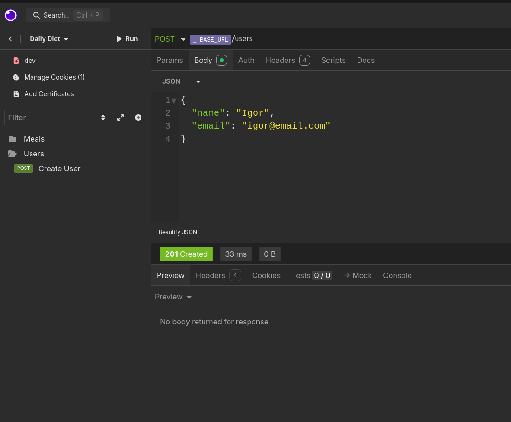
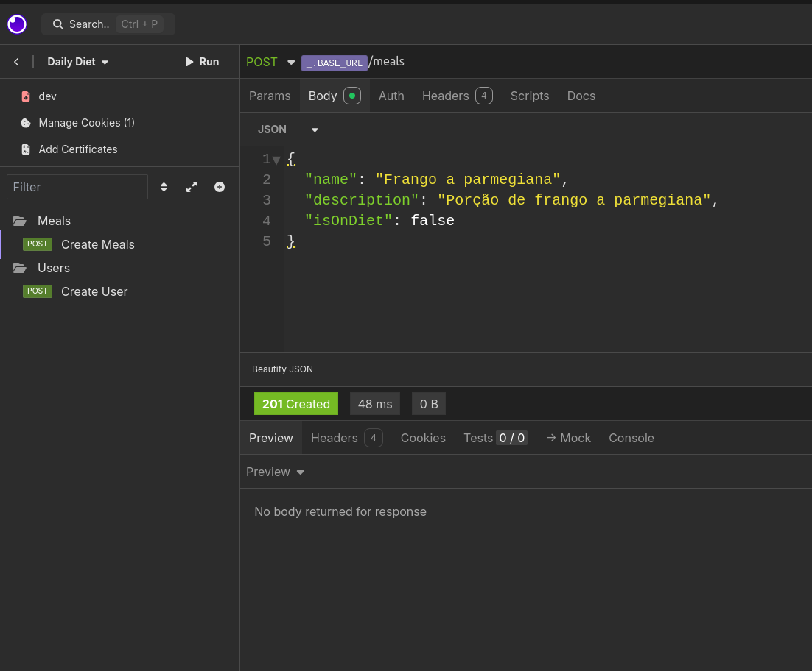
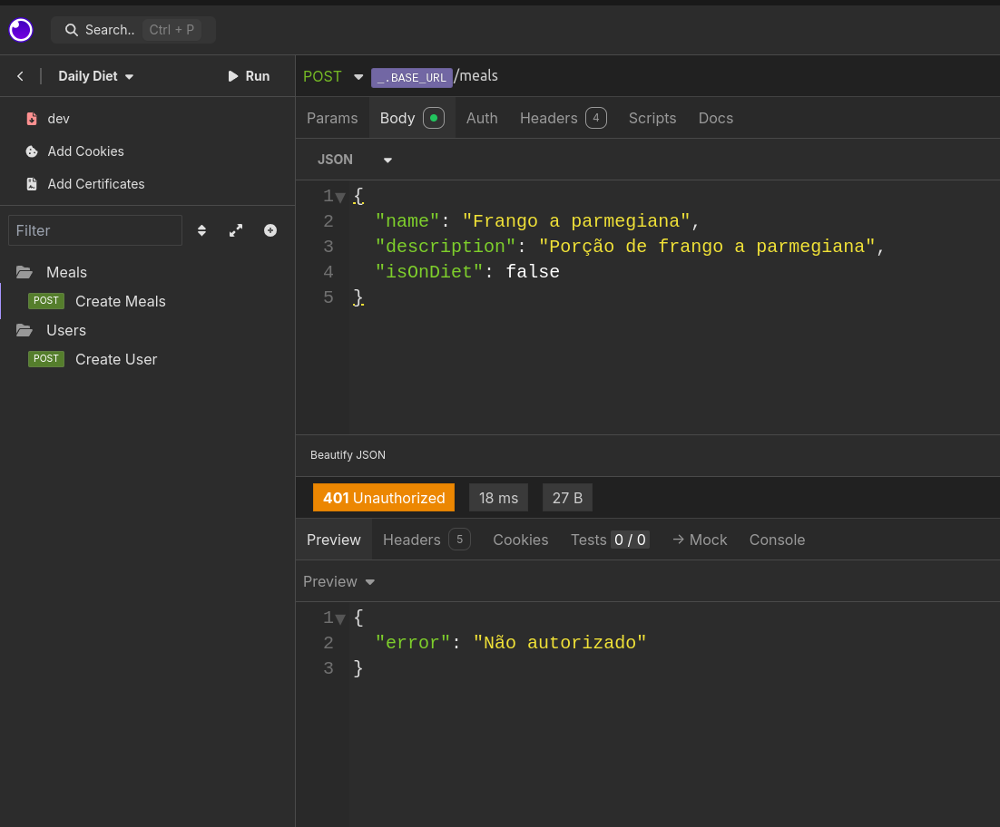

# Daily Diet API
___

- Nesse desafio proposto pela [Rocketseat](https://www.rocketseat.com.br/), vamos fazer uma API em ***NODE***, para controle de refeições;

### Ferramentas Utilizadas
- [Fastify](https://fastify.dev/)
- [Knex](https://knexjs.org/)
- [Sqlite](https://www.sqlite.org/)
- [Zod](https://zod.dev/)
- [Biome](https://biomejs.dev/)
- [Typescript](https://www.typescriptlang.org/)
- [Insomnia](https://insomnia.rest/)

## Regras da aplicação
- [x] Deve ser possível criar um usuário
- [x] Deve ser possível identificar o usuário entre as requisições
- [x] Deve ser possível registrar uma refeição feita, com as seguintes informações:
  - Nome
  - Descrição
  - Data e Hora
  - Está dentro da dieta ou não
- [ ] Deve ser possível editar uma refeição, podendo alterar todos os dados acima
- [ ] Deve ser possível apagar uma refeição
- [x] Deve ser possível listar todas as refeições de um usuário
- [ ] Deve ser possível visualizar uma única refeição
- [ ] Deve ser possível recuperar as métricas de um usuário
  - Quantidade total de refeições
  - Quantidade total de refeições dentro da dieta
  - Quantidade total de refeições fora da dieta
  - Melhor sequência de refeições dentro da dieta
- [ ] O usuário só pode visualizar, editar e apagar as refeições o qual ele criou

## Screenshots

##### Criação de um usuário

##### Criação de uma refeição pelo mesmo usuário

##### Criação de uma refeição por um usuário diferente do identificado via cookies
